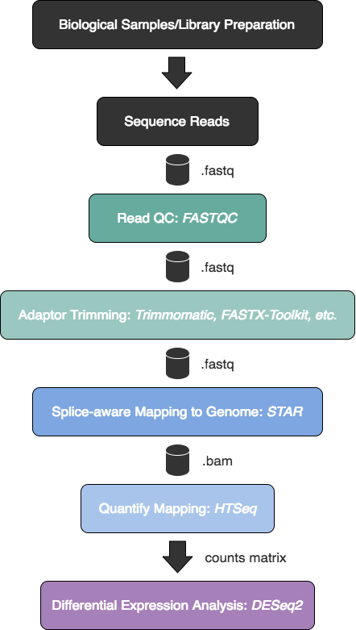

## Learning Objectives 

* Introduce DGE and experimental design
* Set up an RNA-seq project in RStudio 
* Understand RNA-seq and DGE analysis workflow
* Understand the use of negative binomial distribution to model RNA-seq count data

# Differential gene expression (DGE) analysis overview 

The most common use of RNA-seq data is to perform differential expression analysis to identify genes that are differentially expressed between conditions. The results of a DGE analysis can offer biological insight into the effect of your condition of interest on genome-wide gene regulatory patterns. 

Below is detailed workflow of the major steps involved in DGE analaysis. All steps will performed using a combination of the command line in a Linux/Unix environment and RStudio. The DGE analysis itself and subsequent downstream functional analysis will be performed in RStudio.

In the following submodules, we will go through an **end-to-end gene-level RNA-seq differential expression workflow** using various R packages. We will start with the count matrix, perform exploratory data analysis for quality assessment and to explore the relationship between samples, perform differential expression analysis, and visually explore the results prior to performing downstream functional analysis.
