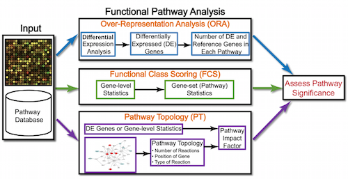

Learning Objectives:
-------------------

*  Determine how functions are attributed to genes using Gene Ontology terms
*  Understand the theory of how functional enrichment tools yield statistically enriched functions or interactions
*  Discuss functional analysis using over-representation analysis, functional class scoring, and pathway topology methods
*  Explore functional analysis tools

# Functional analysis 

The output of RNA-seq differential expression analysis is a list of significant differentially expressed genes (DEGs). To gain greater biological insight on the differentially expressed genes there are various analyses that can be done:

- determine whether there is enrichment of known biological functions, interactions, or pathways
- identify genes' involvement in novel pathways or networks by grouping genes together based on similar trends
- use global changes in gene expression by visualizing all genes being significantly up- or down-regulated in the context of external interaction data

Generally for any differential expression analysis, it is useful to interpret the resulting gene lists using freely available web- and R-based tools.  While tools for functional analysis span a wide variety of techniques, they can loosely be categorized into three main types: over-representation analysis, functional class scoring, and pathway topology.



The goal of functional analysis is provide biological insight, so it's necessary to analyze our results in the context of our experimental hypothesis: **FMRP and MOV10 associate and regulate the translation of a subset of RNAs**. Therefore, based on the authors' hypothesis, we may expect the enrichment of processes/pathways related to **translation, splicing, and the regulation of mRNAs**, which we would need to validate experimentally.

***Note that all tools described below are great tools to validate experimental results and to make hypotheses. These tools suggest genes/pathways that may be involved with your condition of interest; however, you should NOT use these tools to make conclusions about the pathways involved in your experimental process. You will need to perform experimental validation of any suggested pathways.***

## Over-representation analysis
There are a plethora of functional enrichment tools that perform some type of over-representation analysis by querying databases containing information about gene function and interactions. **Querying these databases for gene function requires the use of a _consistent vocabulary_ to describe gene function.** One of the most widely-used vocabularies is the **Gene Ontology (GO)**. This vocabulary was established by the Gene Ontology project, and the words in the vocabulary are referred to as GO terms. 

### Gene Ontology project

"The Gene Ontology project is a collaborative effort to address the need for consistent descriptions of gene products across databases" [[2](geneontology.org/page/documentation)]. The [Gene Ontology Consortium](http://geneontology.org/page/go-consortium-contributors-list) maintains the GO terms, and these GO terms are incorporated into gene annotations in many of the popular repositories for animal, plant, and microbial genomes. 

Tools that investigate **enrichment of biological functions or interactions** can query these databases for GO terms associated with a list of genes to determine whether any GO terms associated with particular functions or interactions are enriched in the gene set. Therefore, to best use and interpret the results from these functional analysis tools, it is helpful to have a good understanding of the GO terms themselves.

### GO terms

#### GO Ontologies

To describe the roles of genes and gene products, GO terms are organized into three independent controlled vocabularies (ontologies) in a species-independent manner: 

- **Biological process:** refers to the biological role involving the gene or gene product, and could include "transcription", "signal transduction", and "apoptosis". A biological process generally involves a chemical or physical change of the starting material or input.
- **Molecular function:** represents the biochemical activity of the gene product, such activities could include "ligand", "GTPase", and "transporter". 
- **Cellular component:** refers to the location in the cell of the gene product. Cellular components could include "nucleus", "lysosome", and "plasma membrane".

Each GO term has a term name (e.g. **DNA repair**) and a unique term accession number (**GO:0005125**), and a single gene product can be associated with many GO terms, since a single gene product "may function in several processes, contain domains that carry out diverse molecular functions, and participate in multiple alternative interactions with other proteins, organelles or locations in the cell" [[3](go.pdf)]. 

#### GO term hierarchy

Some gene products are well-researched, with vast quantities of data available regarding their biological processes and functions. However, other gene products have very little data available about their roles in the cell. 

For example, the protein, "p53", would contain a wealth of information on it's roles in the cell, whereas another protein might only be known as a "membrane-bound protein" with no other information available. 

The GO ontologies were developed to describe and query biological knowledge with differing levels of information available. To do this, GO ontologies are loosely hierarchical, ranging from general, 'parent', terms to more specific, 'child' terms. The GO ontologies are "loosely" hierarchical since 'child' terms can have multiple 'parent' terms.

Some genes with less information may only be associated with general 'parent' terms or no terms at all, while other genes with a lot of information be associated with many terms.


## clusterProfiler

We will be using [clusterProfiler](http://bioconductor.org/packages/release/bioc/html/clusterProfiler.html) to perform over-representation analysis on GO terms associated with our list of significant genes. The tool takes as input a significant gene list and a background gene list and performs statistical enrichment analysis using hypergeometric testing. The basic arguments allow the user to select the appropriate organism and GO ontology (BP, CC, MF) to test. 

### Running clusterProfiler

To run clusterProfiler GO over-representation analysis, we will change our gene names into Ensembl IDs, since the tool works a bit easier with the Ensembl IDs. There are a few clusterProfiler functions that allow us to map between gene IDs:

```r
library(org.Hs.eg.db)
library(DOSE)
library(pathview)
library(SPIA)
library(purrr)
library(clusterProfiler)
library(gProfileR)
library(treemap)

## clusterProfiler does not work as easily using gene names, so we will turn gene names into Ensembl IDs using 
## clusterProfiler::bitr and merge the IDs back with the DE results
keytypes(org.Hs.eg.db)

ids <- bitr(rownames(res_tableOE), 
            fromType = "SYMBOL", 
            toType = c("ENSEMBL", "ENTREZID"), 
            OrgDb = "org.Hs.eg.db")

## The gene names can map to more than one Ensembl ID (some genes change ID over time), 
## so we need to remove duplicate IDs prior to assessing enriched GO terms
non_duplicates <- which(duplicated(ids$SYMBOL) == FALSE)

ids <- ids[non_duplicates, ] 

## Merge the Ensembl IDs with the results     
merged_gene_ids <- merge(x=data.frame(res_tableOE), y=ids, by.x="row.names", by.y="SYMBOL")             

## Extract significant results
sigOE <- subset(merged_gene_ids, padj < 0.05)

sigOE_genes <- as.character(sigOE$ENSEMBL)

```

>**NOTE:** The different organisms with annotation databases available to use with clusterProfiler can be found [here](../img/orgdb_annotation_databases.png)

We will use the Ensembl IDs for all genes as the background dataset:

```r
## Create background dataset for hypergeometric testing using all genes tested for significance in the results                 
allOE_genes <- as.character(merged_gene_ids$ENSEMBL)
```

Now we can perform the GO enrichment analysis:

```r
## Run GO enrichment analysis 
ego <- enrichGO(gene = sigOE_genes, 
                    universe = allOE_genes, 
                    keytype = "ENSEMBL", 
                    OrgDb = org.Hs.eg.db, 
                    ont = "BP", 
                    pAdjustMethod = "BH", 
                    qvalueCutoff = 0.05, 
                    readable = TRUE)

## Output results from GO analysis to a table
cluster_summary <- data.frame(ego)

write.csv(cluster_summary, "results/clusterProfiler_Mov10oe.csv")
```


### Visualizing clusterProfiler results
clusterProfiler has a variety of options for viewing the over-represented GO terms. We will explore the dotplot, enrichment plot, and the category netplot.

The **dotplot** shows the number of genes associated with the first 50 terms (size) and the p-adjusted values for these terms (color). 

```r
## Dotplot gives top 50 genes by gene ratio (# genes related to GO term / total number of sig genes), not padj.
dotplot(ego, showCategory=50)
```

**To save the figure,** click on the `Export` button in the RStudio `Plots` tab and `Save as PDF...`. In the pop-up window, change:
- `Orientation:` to `Landscape`
- `PDF size` to `8 x 14` to give a figure of appropriate size for the text labels


The next plot is the **enrichment GO plot**, which shows the relationship between the top 50 most significantly enriched GO terms, by grouping similar terms together. The color represents the p-values relative to the other displayed terms (brighter red is more significant) and the size of the terms represents the number of genes that are significant from our list.

```r
## Enrichmap clusters the 50 most significant (by padj) GO terms to visualize relationships between terms
enrichMap(ego, n=50, vertex.label.font=6)
```

**To save the figure,** click on the `Export` button in the RStudio `Plots` tab and `Save as PDF...`. In the pop-up window, change the `PDF size` to `24 x 32` to give a figure of appropriate size for the text labels.


Finally, the **category netplot** shows the relationships between the genes associated with the top five most significant GO terms and the fold changes of the significant genes associated with these terms (color). The size of the GO terms reflects the pvalues of the terms, with the more significant terms being larger. This plot is particularly useful for hypothesis generation in identifying genes that may be important to several of the most affected processes. 

```r
## To color genes by log2 fold changes, we need to extract the log2 fold changes from our results table creating a named vector
OE_foldchanges <- sigOE$log2FoldChange

names(OE_foldchanges) <- sigOE$Row.names

## Cnetplot details the genes associated with one or more terms - by default gives the top 5 significant terms (by padj)
cnetplot(ego, 
         categorySize="pvalue", 
         showCategory = 5, 
         foldChange=OE_foldchanges, 
         vertex.label.font=6)
         
## If some of the high fold changes are getting drowned out due to a large range, you could set a maximum fold change value
OE_foldchanges <- ifelse(OE_foldchanges > 2, 2, OE_foldchanges)
OE_foldchanges <- ifelse(OE_foldchanges < -2, -2, OE_foldchanges)

cnetplot(ego, 
         categorySize="pvalue", 
         showCategory = 5, 
         foldChange=OE_foldchanges, 
         vertex.label.font=6)
```

**Again, to save the figure,** click on the `Export` button in the RStudio `Plots` tab and `Save as PDF...`. Change the `PDF size` to `48 x 56` to give a figure of appropriate size for the text labels.


## Resources for functional analysis

* g:Profiler - http://biit.cs.ut.ee/gprofiler/index.cgi 
* DAVID - http://david.abcc.ncifcrf.gov/tools.jsp 
* clusterProfiler - http://bioconductor.org/packages/release/bioc/html/clusterProfiler.html
* GeneMANIA - http://www.genemania.org/
* GenePattern -  http://www.broadinstitute.org/cancer/software/genepattern/ (need to register)
* WebGestalt - http://bioinfo.vanderbilt.edu/webgestalt/ (need to register)
* AmiGO - http://amigo.geneontology.org/amigo
* ReviGO (visualizing GO analysis, input is GO terms) - http://revigo.irb.hr/ 
* WGCNA - http://www.genetics.ucla.edu/labs/horvath/CoexpressionNetwork
* GSEA - http://software.broadinstitute.org/gsea/index.jsp
* SPIA - https://www.bioconductor.org/packages/release/bioc/html/SPIA.html
* GAGE/Pathview - http://www.bioconductor.org/packages/release/bioc/html/gage.html
