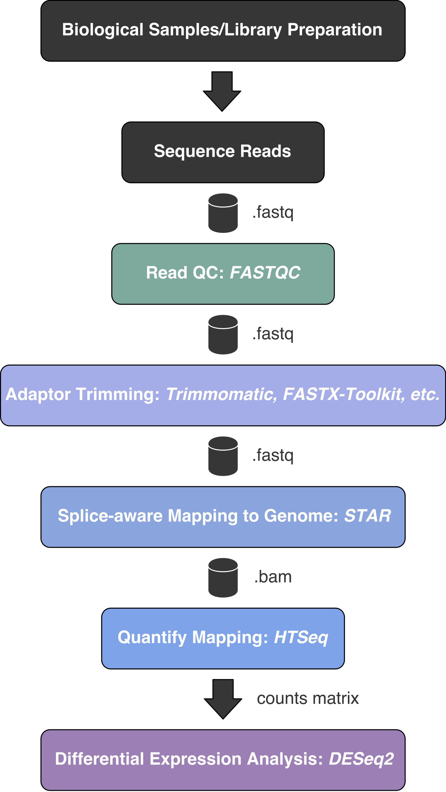
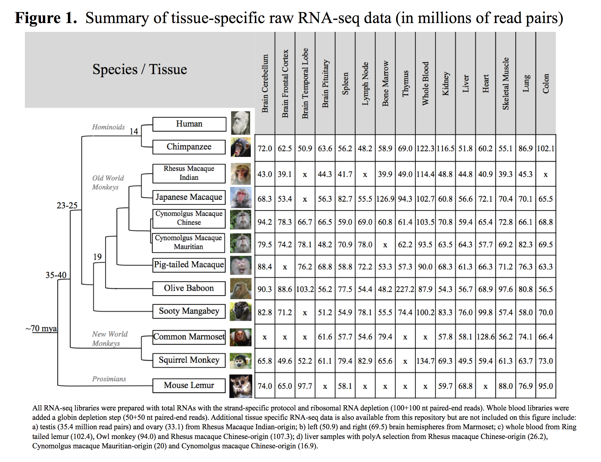

## Learning Objectives 

* Introduce DE analysis 
* Introduce experimental design for the module
* Data pre-processing and generating the count matrix 

# Differential gene expression (DE) analysis overview 

The most common use of RNA-seq data is to perform differential expression analysis to identify genes that are differentially expressed between conditions. The results of a DE analysis can offer biological insight into the effect of your condition of interest on genome-wide gene regulatory patterns. 

Below is detailed workflow of the major steps involved in DE analaysis. All steps will be performed using a combination of the command line in a Linux/Unix environment and RStudio. The DE analysis itself and subsequent downstream functional analysis will be performed in RStudio.


  
In the following submodules, we will go through an **end-to-end gene-level RNA-seq differential expression workflow** using various R packages. We will start with the count matrix, perform exploratory data analysis for quality assessment and to explore the relationship between samples, perform differential expression analysis, and visually explore the results prior to performing downstream functional analysis.

## Experimental Design

For this module we will utilize a subset of data from the Non-Human Primate Reference Transcriptome Resource (NHPRTR), described here: [Peng et al. 2014](https://academic.oup.com/nar/article/43/D1/D737/2437575)
We will replicate a portion of the analysis described in [Trizzino et al. 2017](http://genome.cshlp.org/content/27/10/1623.full.pdf). This study used RNA-seq data from liver samples of humans, chimpanzees, rhesus macaques, marmosets, bushbabies, and mouse lemurs to permorm a series of tests for differential expression: 

1) Apes (humans + chimpanzees) vs. non-apes (rhesus macaques + marmosets + bushbabies + mouse lemurs) 

2) Catarrhines (humans + chimpanzees + rhesus macaques) vs. non-Catarrhines (marmosets + bushbabies + mouse lemurs) 

3) Haplorhini (human + chimpanzee + rhesus macaque + marmoset) vs. Strepsirrhini (mouse lemur + bushbaby)

We will use RNA-seq data derived from skeletal muscle of 12 primates (Human, Chimpanzee, Pig-tailed_macaque, Japanese_macaque, Rhesus_macaque, Cynomolgous_Mauritian, Cynomolgous_Chinese, Baboon, Sooty_mangabey, Marmoset, Squirrel_monkey, Mouse_lemur)



Our DE analysis will replicate the three tests from above using available species from the NHPRTR: 

1) Apes (Human + Chimpanzee) vs. non-apes (Pig-tailed_macaque + Japanese_macaque + Rhesus_macaque + Cynomolgous_Mauritian + Cynomolgous_Chinese + Baboon + Sooty_mangabey + Marmoset + Squirrel_monkey + Mouse_lemur)

2) Catarrhines (Human + Chimpanzee + Pig-tailed_macaque + Japanese_macaque, Rhesus_macaque + Cynomolgous_Mauritian + Cynomolgous_Chinese + Baboon + Sooty_mangabey) vs. non-Catarrhines (Marmoset + Squirrel_monkey + Mouse_lemur)

3) Haplorhini (human + chimpanzee + Pig-tailed_macaque + Japanese_macaque + rhesus macaque + Cynomolgous_Mauritian + Cynomolgous_Chinese + Baboon + Sooty_mangabey + Marmoset + Squirrel_monkey) vs Strepsirrhini (Mouse_lemur)

**Note: each species in NHPRTR has one replicate per species per tissue. So for test #3, Strepsirrhini only has a single biological replicate, results from that test should be interpreted with caution**

## Generating the count matrix for DE analysis

The most time consuming stage of the workflow is mapping the reads to the reference genome and quantifying the counts. For large datasets this can take days depending on computational resources available. We won't do the actual mapping as part of this module, but we will walk through the steps you would take to perform trimming, mapping, and quanitifcation on the University of Oregon HPC [Talapas](https://hpcrcf.atlassian.net/wiki/spaces/TCP/overview).

Talapas uses a SLURM job scheduler, which means in order to run jobs in the HPC you must submit your instructions via a slurm file (.srun), all srun files have the following structure:

```
#!/bin/bash
#SBATCH --partition=longfat        ### Partition (like a queue in PBS)
#SBATCH --job-name=repeatmasker      ### Job Name
#SBATCH --output=/projects/ting/yourdirectory/job.out        ### File in which to store job output
#SBATCH --error=/projects/ting/yourdirectory/job.err          ### File in which to store job error messages
#SBATCH --time=14-00:00:00       ### Wall clock time limit in Days-HH:MM:SS
#SBATCH --nodes=1               ### Node count required for the job
#SBATCH --ntasks-per-node=32     ### Number of tasks to be launched per Node

module load (whatever module you want to run)

commands -here-

```
Available partitions can be seen on the Tapalas link above. Many modules in Talapas require dependencies be loaded before the module can be loaded. To check for required dependencies use:

```
module spider modulename
```

For trimming with Trimmomatic, we check for dependencies:
```
module spider Trimmomatic/

--------------------------------------------------------------------------------------------
  Trimmomatic:
--------------------------------------------------------------------------------------------
    Description:
      Trimmomatic performs a variety of useful trimming tasks for illumina paired-end and
      single ended data.The selection of trimming steps and their associated parameters are
      supplied on the command line.

     Versions:
        Trimmomatic/0.32-Java-1.7.0_80
        Trimmomatic/0.36-Java-1.8.0_92
        Trimmomatic/0.36-Java-1.8.0_131
        Trimmomatic/0.36-Java-1.8.0_162
```

We can see that the module can be directly loaded in Talapas (or enter this in our srun file) with:

```
module load Trimmomatic
```
And we can use the following command trim our files:
```
java -jar trimmomatic-0.35.jar SE -phred33 input.fq.gz output.fq.gz ILLUMINACLIP:TruSeq3-SE:2:30:10 LEADING:3 TRAILING:3 SLIDINGWINDOW:4:15 MINLEN:36
```
This will perform the following:
1) Remove adapters (ILLUMINACLIP:TruSeq3-PE.fa:2:30:10)
2) Remove leading low quality or N bases (below quality 3) (LEADING:3)
3) Remove trailing low quality or N bases (below quality 3) (TRAILING:3)
4) Scan the read with a 4-base wide sliding window, cutting when the average quality per base drops below 15 (SLIDINGWINDOW:4:15)
5) Drop reads below the 36 bases long (MINLEN:36)

Next we will map our reads to a reference genome using a splice-aware mapper, STAR, which can be loaded (again, in srun file), with dependencies loaded first (this is called the build tree):
```
module load easybuild  icc/2017.1.132-GCC-6.3.0-2.27  impi/2017.1.132
module load easybuild  ifort/2017.1.132-GCC-6.3.0-2.27  impi/2017.1.132
module load STAR/2.5.3a
```
Before we can map our reads to the reference we have to index the reference, which is done as a separate step with STAR. In order to generate the index you'll need a reference genome fasta file and annotation file in GTF format. The splice junction database overhang should be 1 bp shorter than the reads you intend to map (150 bp reads in this case) and runThreadN can be set to the number of cores to use for the run. The index can be generated as follows:
```
STAR --runMode genomeGenerate --genomeDir /path/to/reference/ --genomeFastaFiles /path/to/genome/fasta --sjdbGTFfile /path/to/annotation/gtf --sjdbOverhang 149 --runThreadN 12
```
Mapping with STAR in 2-pass mode can then be run as follows:
```
STAR --genomeDir /path/to/genomeDir --outSAMtype BAM SortedByCoordinate --sjdbOverhang 149 --readFilesIn /path/to/input/fastq.gz --readFilesCommand zcat --outFileNamePrefix /path/to/output/directory --sjdbGTFtagExonParentGene gene_name --outReadsUnmapped Fastx --twopassMode Basic --outFilterMismatchNoverLmax 0.05 --genomeLoad NoSharedMemory --runThreadN 32
```
This will perform the following:
1) output sorted BAM format
2) input files are gzipped (zcat)
3) use the gene name for mapping information
4) output unmapped reads to a fasta file
5) map in 2-pass mode
6) allow 5% mismatches based on length of mapped read

Finally, we will produce our count matrix using HTSeq:
```
module load easybuild  icc/2017.1.132-GCC-6.3.0-2.27  impi/2017.1.132
module load easybuild  ifort/2017.1.132-GCC-6.3.0-2.27  impi/2017.1.132
module load HTSeq

htseq-count -m union -r pos -i gene_name --stranded=reverse -f bam /path/to/mappingresults/bam /path/to/annotation/gtf > /path/to/output/directory/filname.txt
```
This will perform the following:
1) count mapped reads in union mode
2) assign reads to gene names
3) reads are strand-specific (don't include this unless they are actually ss)

The output is a matrix with genes in the rows and samples in the column. You'll do this process for each of your samples and then create a file counts matrix with genes in the rows and every individual in your study in the columns. Here's an example:
```
GeneSymbol	Human	Chimpanzee	Pigtailed_macaque	Japanese_macaque
A1BG	60	4	4	4
A1BG-AS1	25	2	0	0
A1CF	63	2	4	12
A2M	101667	4078	4458	2522
A2M-AS1	709	24	10	14
```
This count matrix in the raw material for our DE analysis. Proceed to [Introduction to Differential Expression Analysis Part 2](Submodule/Intro_DE_pt2.md)
