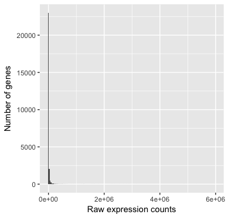
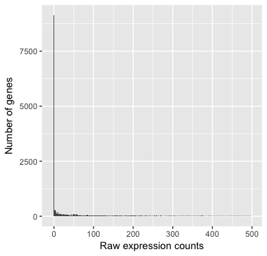
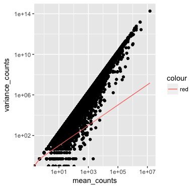
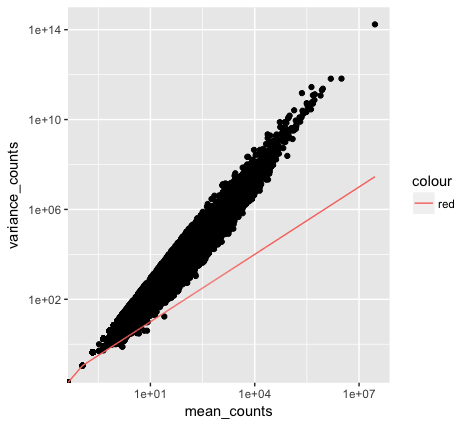
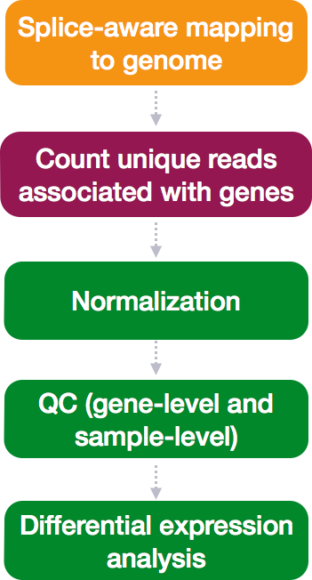

## Learning Objectives

* Set up a DE project in R 
* Understand the use of negative binomial distribution to model RNA-seq count data

## Set up a DE analysis in R

Before we begin we will nedd to set up a new project for this analysis in RStudio: 

1) Go to the `File` menu and select `New Project`.
2) In the `New Project` window, choose `New Directory`. Then, choose `Empty Project`. Name your new directory `DEanalysis` and then "Create the project as subdirectory of:" the Desktop (or location of your choice).
3) The new project should automatically open in RStudio. 

To check whether or not you are in the correct working directory, use `getwd()`. The path `Desktop/DEanalysis` should be returned to you in the console. Within your working directory use the `New folder` button in the bottom right panel to create three new directories: `data`, `meta` and `results`. An important key to a good analysis is establishing project organization before you start. 

Go to the `File` menu and select `New File`, then select `R Script`. This should open up a script editor in the top left hand corner. This is where we will be typing and saving all commands required for this analysis. In the script editor type in header lines:

```
## Gene-level differential expression analysis using DESeq2
```

Now save the file as `de_script.R`. When finished your working directory should now look similar to this:


Finally, we need to grab the files that we will be working with for the analysis. The NHPRTR has provided a massive count matrix of every species/tissue combination, of which I have extracted a subset of data for skeletal muscle from all species, and generated an associated metadata file. Right click on the links below, and choose the "Save link as ..." option and save to your `data` directory:

* Save the [full counts matrix](https://github.com/molecanth/molecanth.github.io/blob/master/module_data/primate_skeletalmuscle-2.txt) file in the `data` directory.
* Save the [full metadata table](https://github.com/molecanth/molecanth.github.io/blob/master/module_data/primate_meta.txt) file in the `meta` directory.

## Loading libraries

For this analysis we will be using several R packages, some which have been installed from CRAN and others from Bioconductor. To use these packages (and the functions contained within them), we need to **load the libraries.** Add the following to your script and don't forget to comment liberally!

```r
## Setup
### Bioconductor and CRAN libraries used
library(ggplot2)
library(RColorBrewer)
library(DESeq2)
library(pheatmap)
library(DEGreport)
```

## Loading data

To load the data into our current environment, we will be using the `read.table` function. We need to provide the path to each file and also specify arguments to let R know that we have a header (`header = T`) and the first column is our row names (`row.names =1`). By default the function expects tab-delimited files, which is what we have.

```r
## Load in data
data <- read.table("data/primate_skeletalmuscle.txt", header=T, row.names=1) 

meta <- read.table("meta/primate_meta.txt", header=T, row.names=1)
```

Use `class()` to inspect our data and make sure we are working with data frames:

```r
### Check classes of the data we just brought in
class(meta)
class(data)
```

## Viewing data

Make sure your datasets contain the expected samples/information before proceeding to perfom any type of analysis. 

```r
View(meta)
View(data)
```
## DE analysis overview

So what does this count data actually represent? The count data used for differential expression analysis represents the number of sequence reads that originated from a particular gene. The higher the number of counts, the more reads associated with that gene, and the assumption that there was a higher level of expression of that gene in the sample. 


With DE analysis, we are looking for genes that change in expression between two or more groups (defined in the metadata) with respect to both the biological and technical variation between conditions, for example:

- treatment vs. control

**Why does it not work to identify differentially expressed gene by ranking the genes by how different they are between the two groups based only on fold change values?**

All RNA-seq datasets have variation between conditions that is not a result the conditions themselves. The goal of DE analysis to indentify genes that are differentially expressed between conditions while controlling for variation introduced by variables that are not of interest.

Even though the mean expression levels between sample groups may appear to be quite different, it is possible that the difference is not actually significant when technical variation is not controlled for. This is illustrated for 'GeneA' expression between 'untreated' and 'treated' groups in the figure below. The mean expression level of geneA for the 'treated' group is twice as large as for the 'untreated' group, but the variation between replicates indicates that this may not be a significant difference. While it's possible that your treatment is driving the variation in transcription, this situation is more often the result of some technical variable, such as a batch effect. **We need to take into account the variation in the data (and where it might be coming from) when determining whether genes are differentially expressed.**


The goal of differential expression analysis is to determine, for each gene, whether the differences in expression (counts) **between groups** is significant given the amount of variation observed **within groups** (replicates). To test for significance, we need an appropriate statistical model that accurately performs normalization (to account for differences in sequencing depth, etc.) and variance modeling (to account for few numbers of replicates and large dynamic expression range).


### RNA-seq count distribution

To determine the appropriate statistical model, we need information about the distribution of counts. To get an idea about how RNA-seq counts are distributed, let's plot the counts for a single sample, `Human`:

```r
ggplot(data) +
  geom_histogram(aes(x = Human), stat = "bin", bins = 200) +
  xlab("Raw expression counts") +
  ylab("Number of genes")
```


If we zoom in close to zero, we can see a large number of genes with counts of zero:

```r
ggplot(data) +
   geom_histogram(aes(x = Human), stat = "bin", bins = 200) + 
   xlim(-5, 500)  +
   xlab("Raw expression counts") +
   ylab("Number of genes")
```


These images illustrate some common features of RNA-seq count data, including a **low number of counts associated with a large proportion of genes**, and a long right tail due to the **lack of any upper limit for expression**. Unlike microarray data, which has a dynamic range maximum limited due to when the probes max out, there is no limit of maximum expression for RNA-seq data. Due to the differences in these technologies, the statistical models used to fit the data are different between the two methods. 

> **NOTE:** The log intensities of the microarray data approximate a normal distribution. However, due to the different properties of the of RNA-seq count data, such as integer counts instead of continuous measurements and non-normally distributed data, the normal distribution does not accurately model RNA-seq counts [[1](https://www.ncbi.nlm.nih.gov/pmc/articles/PMC3541212/)].

### Modeling count data

Count data is often modeled using the **binomial distribution**, which can give you the **probability of getting a number of heads upon tossing a coin a number of times**. However, not all count data can be fit with the binomial distribution. The binomial is based on discrete events and used in situations when you have a certain number of cases.

When **the number of cases is very large (e.g. people who buy lottery tickets), but the probability of an event is very small (probability of winning)**, the **Poisson distribution** is used to model these types of count data. The Poisson is similar to the binomial, but is based on continuous events.

**With RNA-Seq data, a very large number of RNAs are represented and the probability of pulling out a particular transcript is very small**. Thus, it would be an appropriate situation to use the Poisson distribution. **However**, a unique property of this distribution is that the mean == variance. Realistically, with RNA-Seq data there is always some biological variation present across the replicates (within a sample class). Genes with larger average expression levels will tend to have larger observed variances across replicates. 

If the proportions of mRNA stayed exactly constant between the biological replicates for each sample class, we could expect Poisson distribution (where mean == variance). [A nice description of this concept is presented by Rafael Irizarry in the EdX class](https://youtu.be/HK7WKsL3c2w). But this doesn't happen in practice, and so the Poisson distribution is only considered appropriate for a single biological sample. 

The model that fits best, given this type of variability between replicates, is the Negative Binomial (NB) model. Essentially, **the NB model is a good approximation for data where the mean < variance**, as is the case with RNA-Seq count data.

>**NOTE:** 
>
> - **Biological replicates** represent multiple samples (i.e. RNA from different monkeys) representing the same sample class
> - **Technical replicates** represent the same sample (i.e. RNA from the same monkey) but with technical steps replicated
> - Usually biological variance is much greater than technical variance, so we do not need to account for technical variance to identify biological differences in expression
> - **Don't spend money on technical replicates - biological replicates are much more useful**

#### How do I know if my data should be modeled using the Poisson distribution or Negative Binomial distribution?

If it's count data, it should fit the negative binomial, as discussed previously. However, it can be helpful to plot the *mean versus the variance* of your data to see for yourself. *Remember for the Poisson model, mean = variance, but for NB, mean < variance.*

Run the following code to plot the *mean versus variance* for the `Ape` replicates:

```r
mean_counts <- apply(data[, 1:2], 1, mean)
variance_counts <- apply(data[, 1:2], 1, var)
df <- data.frame(mean_counts, variance_counts)

ggplot(df) +
        geom_point(aes(x=mean_counts, y=variance_counts)) + 
        geom_line(aes(x=mean_counts, y=mean_counts, color="red")) +
        scale_y_log10() +
        scale_x_log10()
```


Note that in the above figure, the variance across replicates tends to be greater than the mean (red line), especially for genes with large mean expression levels. *This is a good indication that our data do not fit the Poisson distribution and we need to account for this increase in variance using the Negative Binomial model (i.e. Poisson will underestimate variability leading to an increase in false positive DE genes).*

### Improving mean estimates (i.e. reducing variance) with biological replicates

The variance or scatter tends to reduce as we increase the number of biological replicates (*the distribution will approach the Poisson distribution with increasing numbers of replicates*), since standard deviations of averages are smaller than standard deviations of individual observations. **The value of additional replicates is that as you add more data (replicates), you get increasingly precise estimates of group means, and ultimately greater confidence in the ability to distinguish differences between sample classes (i.e. more DE genes).**

Let's take a look for fun. There are a lot more replicates for `non-apes` than there are for `Apes`, so if we plot the *mean versus variance* for those replicates we see:

```
mean_counts <- apply(data[, 3:11], 1, mean)
variance_counts <- apply(data[, 3:11], 1, var)
df <- data.frame(mean_counts, variance_counts)

ggplot(df) +
        geom_point(aes(x=mean_counts, y=variance_counts)) + 
        geom_line(aes(x=mean_counts, y=mean_counts, color="red")) +
        scale_y_log10() +
        scale_x_log10()
```


The variance is reduced with more biological replicates. 


### Differential expression analysis workflow

To model counts appropriately when performing a differential expression analysis, there are a number of software packages that have been developed for differential expression analysis of RNA-seq data. Even as new methods are continuously being developed a few  tools are generally recommended as best practice, e.g. **[DESeq2](https://bioconductor.org/packages/release/bioc/html/DESeq2.html)** and **[EdgeR](https://bioconductor.org/packages/release/bioc/html/edgeR.html)**. Both of these tools use the negative binomial model, employ similar methods, and typically, yield similar results. They are pretty stringent, and have a good balance between sensitivity and specificity (reducing both false positives and false negatives).

**We will be using [DESeq2](https://genomebiology.biomedcentral.com/articles/10.1186/s13059-014-0550-8) for the DE analysis, and the analysis steps are shown in the flowchart below in green**. DESeq2 first normalizes the count data to account for differences in library sizes and RNA composition between samples. Then, we will use the normalized counts to make some plots for QC at the gene and sample level. The final step is to use the appropriate functions from the DESeq2 package to perform the differential expression analysis. Additional details and helpful suggestions regarding DESeq2 can be found in the [DESeq2 vignette](http://bioconductor.org/packages/devel/bioc/vignettes/DESeq2/inst/doc/DESeq2.html).



Proceed to [RNA-seq QC using principal component analysis (PCA) and heirarchical clustering](../Submodule/QC_sample_clustering.md)
