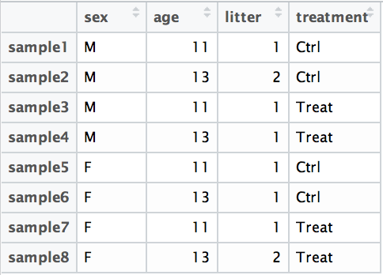

## Learning Objectives 

* Understanding the different steps in a differential expression analysis in the context of DESeq2
* Executing the differential expression analysis workflow with DESeq2
* Constructing design formulas appropriate for a given experimental design

# Differential expression analysis with DESeq2

The final step in the differential expression analysis workflow is fitting the raw counts to the NB model and performing the statistical test for differentially expressed genes. In this step we essentially want to determine whether the mean expression levels of different sample groups are significantly different.


The [DESeq2 paper](https://genomebiology.biomedcentral.com/articles/10.1186/s13059-014-0550-8) was published in 2014, but the package is continually updated and available for use in R through Bioconductor. It builds on good ideas for dispersion estimation and use of Generalized Linear Models from the [DSS](https://www.ncbi.nlm.nih.gov/pmc/articles/PMC4005660/) and [edgeR](https://www.ncbi.nlm.nih.gov/pmc/articles/PMC2796818/) methods. 

Differential expression analysis with DESeq2 involves multiple steps as displayed in the flowchart below in blue. Briefly, DESeq2 will model the raw counts, using normalization factors (size factors) to account for differences in library depth. Then, it will estimate the gene-wise dispersions and shrink these estimates to generate more accurate estimates of dispersion to model the counts. Finally, DESeq2 will fit the negative binomial model and perform hypothesis testing using the Wald test.


> **NOTE:** DESeq2 is actively maintained by the developers and continuously being updated. As such, it is important that you note the version you are working with. Recently, there have been some rather **big changes implemented**. To find out more detail about the specific **modifications made to methods described in the original 2014 paper**, take a look at [this section in the DESeq2 vignette](http://bioconductor.org/packages/devel/bioc/vignettes/DESeq2/inst/doc/DESeq2.html#methods-changes-since-the-2014-deseq2-paper). 

## Running DESeq2

Prior to performing the differential expression analysis, it is a good idea to know what **sources of variation** are present in your data, either by exploration during the QC and/or prior knowledge. Once you know the major sources of variation, you can remove them prior to analysis or control for them in the statistical model by including them in your **design formula**. 

### Design formula

A design formula tells the statistical software the known sources of variation to control for, as well as, the factor of interest to test for during differential expression testing. For example, if you know that sex is a significant source of variation in your data, then `sex` should be included in your model. **The design formula should have all of the factors in your metadata that account for major sources of variation in your data. The last factor entered in the formula should be the condition of interest.**

For example, suppose you have the following metadata:



If you want to examine the expression differences between treatments, and you know that major sources of variation include `sex` and `age`, then your design formula would be:

`design <- ~ sex + age + treatment`

The tilde (`~`) should always proceed your factors and tells DESeq2 to model the counts using the following formula. Note the **factors included in the design formula need to match the column names in the metadata**. 

#### Complex designs

DESeq2 also allows for the analysis of complex designs. You can explore interactions or 'the difference of differences' by specifying for it in the design formula. For example, if you wanted to explore the effect of sex on the treatment effect, you could specify for it in the design formula as follows: 

`design <- ~ sex + age + treatment + sex:treatment`

Since the interaction term `sex:treatment` is last in the formula, the results output from DESeq2 will output results for this term. **Alternatively, as recommended in the [DESeq2 vignette](https://www.bioconductor.org/packages/devel/bioc/vignettes/DESeq2/inst/doc/DESeq2.html#interactions), we could create a new factor variable in our metadata based on the two interaction factors as shown in the table below**:


The design formula would be:

`design <- ~ age + treat_sex`

> **NOTE:** The design `~ sex + age + treatment + treat_sex` won't work (because the model can't be fit) because `treatment` and `treat_sex` are confounded (same goes for `sex`). Therefore, we drop the terms that went into `treat_sex` from the design formula.

### Primate Skeletal Muscle DE analysis 

Now that we know how to specify the model to DESeq2, we can run the differential expression pipeline on the **raw counts**. 

**To get our differential expression results from our raw count data, we only need to run 2 lines of code!**

First we create a DESeqDataSet as we did earlier and specify the location of our raw counts and metadata, and input our design formula:

```r
## Create DESeq object
dds <- DESeqDataSetFromMatrix(countData = data, colData = meta, design = ~ Ape)
```

Then, to run the actual differential expression analysis, we use a single call to the function `DESeq()`. 

```r
## Run analysis
dds <- DESeq(dds)
```

By re-assigning the results of the function back to the same variable name (`dds`), we can fill in the `slots` of our `DESeqDataSet` object. 
*The rest of the module will use our results from this test, but now you can also run the other two tests on your own by creating new DESeq objects with* `design = ~ Catarrhine` *and* `design = ~ Haplorhini`.*Note that if you run the other analysis the results from this analysis will be overwritten. You can get around this by using different naming schemes for each of the tests, e.g.* `dds_catarrhine <- DESeqDataSetFromMatrix(countData = data, colData = meta, design = ~ Catarrhine)`, just remember to rename all of the objects according throughout the analysis.   

**Everything from normalization to linear modeling was carried out by the use of a single function!** This function will print out a message for the various steps it performs: 

```
estimating size factors
estimating dispersions
gene-wise dispersion estimates
mean-dispersion relationship
final dispersion estimates
fitting model and testing
``` 

> **NOTE:** There are individual functions available in DESeq2 that would allow us to carry out each step in the workflow in a step-wise manner, rather than a single call. We demonstrated one example when generating size factors to create a normalized matrix. By calling `DESeq()`, the individual functions for each step are run for you.

## Hypothesis testing using the Wald test

The shrunken LFC estimates are output for each sample group relative to the mean expression across groups. These estimates represent the **model coefficients**, and these coefficients are calculated regardless of the comparison of interest.

However, generally **we are interested in the LFC estimates relative to other sample groups**. To do this, we must test if the difference in the log2 fold changes between groups is zero. To determine whether the difference in shrunken LFC estimates differs significantly from zero, the **Wald test** is used. The Wald test is generally used to make pair-wise comparisons (i.e. compare the LFCs from two different conditions).


## Primate Skeletal Muscle DE analysis

We have two sample classes, `Y` and `N`, so DE analysis is a pairwise comparison, we can first explore the results by calling the `results` function on `dds` and putting them into a results table called `res`:

```
res<-results(dds)
```
We can then call the `summary` function on `res` to explore the results:
```
summary(res)
```
Which will produce the following summary:
```
out of 20424 with nonzero total read count
adjusted p-value < 0.1
LFC > 0 (up)     : 1935, 9.5% 
LFC < 0 (down)   : 1101, 5.4% 
outliers [1]     : 0, 0% 
low counts [2]   : 2760, 14% 
(mean count < 1)
[1] see 'cooksCutoff' argument of ?results
[2] see 'independentFiltering' argument of ?results
```
In addition to the number of genes up- and down-regulated at the default threshold, **the function also reports the number of genes that were tested (genes with non-zero total read count), and the number of genes not included in multiple test correction due to a low mean count** (which in our case is < 7 and was determined automatically by DESeq2 based on overall counts).

The default FDR threshold is set using the option `alpha` within `summary()`; 0.1 is quite liberal so let's try changing that to `0.05` -- *how many genes are we left with*?
```
out of 20424 with nonzero total read count
adjusted p-value < 0.05
LFC > 0 (up)     : 1391, 6.8% 
LFC < 0 (down)   : 711, 3.5% 
outliers [1]     : 0, 0% 
low counts [2]   : 2760, 14% 
(mean count < 1)
[1] see 'cooksCutoff' argument of ?results
[2] see 'independentFiltering' argument of ?results
```
If we want to take a look at specific genes we can sort the results table by FDR and take a look at the top differentially expressed genes:
```
res<-res[order(res$padj),]
head(res)
```
Our `head` function by default shows the first 11 lines:
```
log2 fold change (MAP): Ape Y vs N 
Wald test p-value: Ape Y vs N 
DataFrame with 6 rows and 6 columns
                  baseMean log2FoldChange     lfcSE       stat       pvalue         padj
                 <numeric>      <numeric> <numeric>  <numeric>    <numeric>    <numeric>
MYH4          355542.72916      -8.528183 0.8169272 -10.439343 1.639414e-25 2.900616e-21
MYH13          36028.03098      -7.957873 0.7890322 -10.085613 6.396492e-24 5.658656e-20
LOC100506548     173.47971       6.492664 0.6571743   9.879668 5.100177e-23 3.007914e-19
NDUFC2-KCTD14     82.98515       8.921965 0.9242791   9.652890 4.778938e-22 2.113844e-18
DDN              962.89222       8.688411 0.9058573   9.591368 8.692478e-22 3.075920e-18
LOC100190986     207.27021       7.924954 0.8316532   9.529158 1.585646e-21 4.675807e-18
```
We can see that we have a fairly large number of DE genes between apes and non-apes, and that the most differentially expressed genes are highly significant with large log-fold changes. 

> **NOTE: on p-values set to NA**
> > 
> 1. If within a row, all samples have zero counts, the baseMean column will be zero, and the log2 fold change estimates, p-value and adjusted p-value will all be set to NA.
> 2. If a row contains a sample with an extreme count outlier then the p-value and adjusted p-value will be set to NA. These outlier counts are detected by Cook’s distance. 
> 3. If a row is filtered by automatic independent filtering, for having a low mean normalized count, then only the adjusted p-value will be set to NA. 


#### Multiple test correction

Note that we have pvalues and p-adjusted values in the output. Which should we use to identify significantly differentially expressed genes?

If we used the `p-value` directly from the Wald test with a significance cut-off of 0.05 (α = 0.05), then we expect 5% of all differentially expressed genes to be false positives. Each p-value is the result of a single test (single gene). The more genes we test, the more we inflate the false positive rate. **This is the multiple testing problem.** For example, if we test 20,000 genes for differential expression, at p < 0.05 we would expect to find 1,000 genes by chance. If we found 3000 genes to be differentially expressed total, roughly one third of our genes are false positives. We would not want to sift through our "significant" genes to identify which ones are true positives.

DESeq2 helps reduce the number of genes tested by removing those genes unlikely to be significantly DE prior to testing, such as those with low number of counts and outlier samples (gene-level QC). However, we still need to correct for multiple testing to reduce the number of false positives, and there are a few common approaches:

- **Bonferroni:** The adjusted p-value is calculated by: p-value * m (m = total number of tests). **This is a very conservative approach with a high probability of false negatives**, so is generally not recommended.
- **FDR/Benjamini-Hochberg:** Benjamini and Hochberg (1995) defined the concept of FDR and created an algorithm to control the expected FDR below a specified level given a list of independent p-values. **An interpretation of the BH method for controlling the FDR is implemented in DESeq2 in which we rank the genes by p-value, then multiply each ranked p-value by m/rank**.
- **Q-value / Storey method:** The minimum FDR that can be attained when calling that feature significant. For example, if gene X has a q-value of 0.013 it means that 1.3% of genes that show p-values at least as small as gene X are false positives.

In DESeq2, the p-values attained by the Wald test are corrected for multiple testing using the Benjamini and Hochberg method by default. There are options to use other methods in the `results()` function. The p-adjusted values should be used to determine significant genes (and can be referred to as FDR as well). The significant genes can be output for visualization and/or functional analysis.

## MA Plot
Next let's visualize our results with an MA plot. The MA plot shows the mean of the normalized counts versus the log2 foldchanges for all genes tested. The genes that are significantly DE are colored red to be easily identified. The DESeq2 package also offers a simple function to generate this plot:
```
plotMA(res, alpha = 0.05, ylim=c(-10,10))
```
Which results in:


This plot allows us to evaluate the magnitude of fold changes and how they are distributed relative to mean expression.

## Narrowing down meaningful genes
We still have a pretty large number of DE genes that will produce a lot of false positive results in downstream analysis. For example, with a very large gene list, GO enrichment results are meaningless as an abundance of terms will enriched because there are so many genes. We really want to reduce the number of DE genes as much as possible while retaining genes with biological relevance. One way we can do this is to **add a fold change threshold**. The `summary()` function doesn't have an argument for fold change threshold. 

Let's first create variables that contain our threshold criteria:

```r
### Set thresholds
padj.cutoff <- 0.05
lfc.cutoff <- 0.58
```

The `lfc.cutoff` is set to 0.58; remember that we are working with log2 fold changes so this translates to an actual fold change of 1.5 which is pretty conservative. Let's create a vector that helps us identify the genes that meet our criteria:

```r
threshold <- res$padj < padj.cutoff & abs(res$log2FoldChange) > lfc.cutoff
```
We now have a logical vector of values that has a length which is equal to the total number of genes in the dataset. The elements that have a `TRUE` value correspond to genes that meet the criteria (and `FALSE` means it fails). **How many genes are differentially expressed in Apes compared to non-apes, given our criteria specified above?** Does this reduce our results? 

```r
length(which(threshold))
```

Now we can easily subset the results table to only include those that are significant using the `subset()` function:
```r
sigApe <- <- subset(res, padj<0.05 & abs(res$log2FoldChange)>0.58, select=c(baseMean:padj))
```

## Visualizing the results

When we are working with large amounts of data it can be useful to display that information graphically to gain more insight. Visualization deserves an entire course of its own, but during this module we will get you started with some basic plots commonly used when exploring differential gene expression data.

One way to visualize results would be to simply plot the expression data for a handful of our top genes. We could do that by starting with our most highly significant gene *MYH4*:

```r
# Plot expression for single gene
plotCounts(dds, gene="MYH4", intgroup="Ape")
```


### Volcano plot

The above plot would be great to validate a select few genes, but for more of a global view there are other plots we can draw. A commonly used one is a volcano plot; in which you have the log transformed adjusted p-values plotted on the y-axis and log2 fold change values on the x-axis. There is no built-in function for the volcano plot in DESeq2, but we can easily draw it using `ggplot2`. First, we will need to create a `data.frame` object from the results, which is currently stored in a `DESeqResults`  object:

```r
# Create dataframe for plotting
df <- data.frame(res)
```

Now we can start plotting. The `geom_point` object is most applicable, as this is essentially a scatter plot:

```
# Volcano plot
ggplot(df) +
     geom_point(aes(x=log2FoldChange, y=-log10(padj), colour=threshold)) +
     xlim(c(-6,6)) + ylim(c(-2,10)) +
     ggtitle('Ape Expression') + theme(plot.title = element_text(hjust = 0.5)) +
     xlab("log2 fold change") + 
     ylab("-log10 adjusted p-value") +
     theme(legend.position = "none",
           plot.title = element_text(size = rel(1.5)),
           axis.title = element_text(size = rel(1.5)),
           axis.text = element_text(size = rel(1.25))) 
```
Which will produce:


**Nice work**, you've identified differentially expressed genes in skeletal muscle between apes and non-apes. You can save you results to a file with:
```
write.csv(as.data.frame(res),file='ApeDE.csv')
```

The next step is to follow-up with some GO enrichment and pathway analysis, for which there are many options, and many now have very useful web-based GUI interfaces with useful tutorials. Some that I'd recommend are:

* g:Profiler - http://biit.cs.ut.ee/gprofiler/index.cgi 
* DAVID - http://david.abcc.ncifcrf.gov/tools.jsp 
* WebGestalt - http://bioinfo.vanderbilt.edu/webgestalt/ (need to register)
* WGCNA - http://www.genetics.ucla.edu/labs/horvath/CoexpressionNetwork
* GSEA - http://software.broadinstitute.org/gsea/index.jsp

You may also find it useful to take a look at some of your most highly differentially expressed genes on an individual basis and see if there are interesting hits. For example, in our apes vs. non-apes DE analysis we can see that 3 of the top 4 most differentially expressed genes belong to the *MYH* family. What is that family? Well, a quick google search let's us know that *MYH* genes are Myosin Heavy Chain genes associated with fast-twitch skeletal muscle. We can find out how many of these genes are present in signifanctly up and downregulated genes, again using our `subset()` function:

```
sigApeUp <- subset(sigApe, log2FoldChange>0, select=c(baseMean:padj))
write.csv(as.data.frame(sigApeUp),file='SigApeUp.csv')
sigApeDown <- subset(sigApe, log2FoldChange<0, select=c(baseMean:padj))
write.csv(as.data.frame(sigApeDown),file='SigApeDown.csv')
```
Now we can move over to our terminal window and count the number of *MYH* genes in up and downregulated genes:

```
cd /directory/of/saved/file
grep -c "MYH" SigApeUp.csv
```
**Remember*** the base level is non-ape, so these are genes upregulated in apes. And we find:
```1```
Then:
```
grep -c "MYH" SigApeDown.csv
```
And:
```4```

So 4/5 differentially expressed *MYH* genes are downregulated skeletal muscle in apes compared to non-apes. Pretty cool. 
These genes make potential targets for downstream functional work. 

***
*This module was developed by Noah D. Simons as part of NSF#1540459. Portions of the materials were adapted from the [DESeq2 vignette](https://bioconductor.org/packages/3.7/bioc/vignettes/DESeq2/inst/doc/DESeq2.html#interactions) and [Harvard Chan Bioinformatics Team](https://hbctraining.github.io/DGE_workshop/). These are open access materials distributed under the terms of the Creative Commons Attribution license (CC BY 4.0), which permits unrestricted use, distribution, and reproduction in any medium, provided the original author and source are credited. We also utilized publically available data from the [NHPRTR](http://www.nhprtr.org/phase2.html)*

