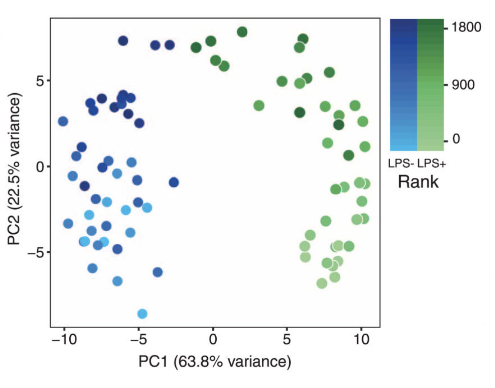

## Learning Objectives

* Understand RNA-seq data normalization
* Create a `DESeqDataset` object
* Understand the priciples of PCA and Hierarchical Clustering
* Perform PCA and HC on our data

## Normalization

Normalization of reads is a necessary step for all visualization procedures, including PCA and hierarchical clustering. **The DE analysis in both DESeq2 and edgeR takes raw counts, and performs their own normalization as part of the DE analysis, normalization is for visualization only (or other downstream analyses)**.


The counts of mapped reads for each gene is proportional to the expression of RNA in addition to other factors. Normalization is the process of scaling raw count values to account for the 'other' factors. Normalization allows the expression levels to be more comparable between and/or within samples.

The main factors often considered during normalization are:
 
 - **Sequencing depth:** Accounting for sequencing depth is necessary for comparison of gene expression between samples. In the example below, each gene appears to have doubled in expression in sample 2, however this is a consequence of sample 2 having double the sequencing depth.
 
    
 
 - **Gene length:** Accounting for gene length is necessary for comparing expression between different genes within the same sample. The number of reads mapped to a longer gene can appear to have equal count/expression as a shorter gene that is more highly expressed. 
 
    
    
While normalization is essential for differential expression analyses, it is also necessary for exploratory data analysis, visualization of data, and whenever you are exploring or comparing counts between or within samples.
 
### Common normalization methods

Several common normalization methods exist to account for these differences:

- **CPM (counts per million):** counts scaled by total number of reads. This method accounts for sequencing depth only.
- **TPM (transcripts per kilobase million):** counts per length of transcript (kb) per million reads mapped. This method accounts for both sequencing depth and gene length.
- **RPKM/FPKM (reads/fragments per kilobase of exon per million reads/fragments mapped):** similar to TPM, as this method also accounts for both sequencing depth and gene length as well; however, it is **not recommended**.
- **Tool-specific metrics for normalization:** 
	- DESeq2 uses a median of ratios method, which accounts for sequencing depth and RNA composition [[1](https://genomebiology.biomedcentral.com/articles/10.1186/gb-2010-11-10-r106)]. 
	- EdgeR uses a trimmed mean of M values (TMM) method that accounts for sequencing depth, RNA composition, and gene length [[2](https://genomebiology.biomedcentral.com/articles/10.1186/gb-2010-11-3-r25)]

### RPKM/FPKM (not recommended)
While TPM and RPKM/FPKM normalization methods both account for sequencing depth and gene length, RPKM/FPKM are not recommended. **The reason  is that the normalized count values output by the RPKM/FPKM method are not comparable between samples.** 

Using RPKM/FPKM normalization, the total number of RPKM/FPKM normalized counts for each sample will be different. Therefore, you cannot compare the normalized counts for each gene equally between samples. 

**RPKM-normalized counts table**

| gene | sampleA | sampleB |
| ----- |:-----:|:-----:|
| XCR1 | 5.5 | 5.5 |
| WASHC1 | 73.4 | 21.8 |
| ... | ... | ... |
|Total RPKM-normalized counts | 1,000,000 | 1,500,000 |

For example, in the table above, SampleA has a greater proportion of counts associated with XCR1 (5.5/1,000,000) than does sampleB (5.5/1,500,000) even though the RPKM count values are the same. Therefore, we cannot directly compare the counts for XCR1 (or any other gene) between sampleA and sampleB because the total number of normalized counts are different between samples. 

### TPM (recommended)
In contrast to RPKM/FPKM, TPM-normalized counts normalize for both sequencing depth and gene length, but have the same total TPM-normalized counts per sample. Therefore, the normalized count values are comparable both between and within samples.

> *NOTE:* [This video by StatQuest](http://www.rna-seqblog.com/rpkm-fpkm-and-tpm-clearly-explained/) shows in more detail why TPM should be used in place of RPKM/FPKM if needing to normalize for sequencing depth and gene length.

### DESeq2-normalized counts: Median of ratios method
Since tools for differential expression analysis are comparing the counts between sample groups for the same gene, gene length does not need to be accounted for by the tool. However, **sequencing depth** and **RNA composition** do need to be taken into account.

To normalize for sequencing depth and RNA composition, DESeq2 uses the median of ratios method. On the user-end there is only one step, but on the back-end there are multiple steps involved, as described below.

> **NOTE:**  The steps below describe in detail some of the steps performed by DESeq2 when you run a single function to get DE genes. Basically, for a typical RNA-seq analysis, **you would not run these steps individually**.

**Step 1: creates a pseudo-reference sample (row-wise geometric mean)**

For each gene, a pseudo-reference sample is created that is equal to the geometric mean across all samples.

| gene | sampleA | sampleB | pseudo-reference sample  |
| ----- |:-----:|:-----:|:-----:|
| EF2A | 1489 | 906 | sqrt(1489 * 906) = **1161.5** |
| ABCD1 | 22 | 13 | sqrt(24 * 13) = **17.7** |
| ... | ... | ... | ... |

**Step 2: calculates ratio of each sample to the reference**

For every gene in a sample, the ratios (sample/ref) are calculated (as shown below). This is performed for each sample in the dataset. Since the majority of genes are not differentially expressed, the majority of genes in each sample should have similar ratios within the sample.

| gene | sampleA | sampleB | pseudo-reference sample  | ratio of sampleA/ref | ratio of sampleB/ref |
| ----- |:-----:|:-----:|:-----:| :-----: | :-----: |
| EF2A | 1489 | 906 | 1161.5 | 1489/1161.5 = **1.28** | 906/1161.5 = **0.78** |
| ABCD1 | 22 | 13 | 16.9 | 22/16.9 = **1.30** | 13/16.9 = **0.77** |
| MEFV | 793 | 410 | 570.2 | 793/570.2 = **1.39** | 410/570.2 = **0.72**
| BAG1 | 76 | 42 | 56.5 | 76/56.5 = **1.35** | 42/56.5 = **0.74**
| MOV10 | 521 | 1196 | 883.7 | 521/883.7 = **0.590** | 1196/883.7 = **1.35** |
| ... | ... | ... | ... |

**Step 3: calculate the normalization factor for each sample (size factor)**

The median value (column-wise for the above table) of all ratios for a given sample is taken as the normalization factor (size factor) for that sample, as calculated below. Notice that the differentially expressed genes should not affect the median value:

`normalization_factor_sampleA <- median(c(1.28, 1.3, 1.39, 1.35, 0.59))`

`normalization_factor_sampleB <- median(c(0.78, 0.77, 0.72, 0.74, 1.35))`
 
The figure below illustrates the median value for the distribution of all gene ratios for a single sample (frequency is on the y-axis).


The median of ratios method makes the assumption that not ALL genes are differentially expressed; therefore, the normalization factors should account for sequencing depth and RNA composition of the sample (large outlier genes will not represent the median ratio values). **This method is robust to imbalance in up-/down-regulation and large numbers of differentially expressed genes.**

> Usually these size factors are around 1, if you see large variations between samples it is important to take note since it might indicate the presence of extreme outliers.

**Step 4: calculate the normalized count values using the normalization factor**

This is performed by dividing each raw count value in a given sample by that sample's normalization factor to generate normalized count values. This is performed for all count values (every gene in every sample). For example, if the median ratio for SampleA was 1.3 and the median ratio for SampleB was 0.77, you could calculate normalized counts as follows:

SampleA median ratio = 1.3

SampleB median ratio = 0.77

**Raw Counts**

| gene | sampleA | sampleB |  
| ----- |:-----:|:-----:|
| EF2A | 1489 | 906 | 
| ABCD1 | 22 | 13 | 
| ... | ... | ... | 

**Normalized Counts**

| gene | sampleA | sampleB |
| ----- |:-----:|:-----:|
| EF2A | 1489 / 1.3 = **1145.39** | 906 / 0.77 = **1176.62** | 
| ABCD1 | 22 / 1.3 = **16.92** | 13 / 0.77 = **16.88** | 
| ... | ... | ... | 

> Please note that normalized count values are not whole numbers.


## Count normalization of our primate skeletal muscle dataset using DESeq2

Now that we know the theory of count normalization, we will normalize the counts for the primate skeletal muscle dataset using DESeq2. This requires a few steps:

1. Ensure the row names of the metadata dataframe are present and in the same order as the column names of the counts dataframe.
2. Create a `DESeqDataSet` object
3. Generate the normalized counts

### 1. Match the metadata and counts data

We should always make sure that we have sample names that match between the two files, and that the samples are in the right order. DESeq2 will output an error if this is not the case.

```r
### Check that sample names match in both files
all(colnames(data) %in% rownames(meta))
all(colnames(data) == rownames(meta))
```

If your data did not match, you could use the `match()` function to rearrange them to be matching.

### 2. Create DESEq2 object

Bioconductor software packages often define and use a custom class within R for storing data (input data, intermediate data and also results). These custom data structures are similar to `lists` in that they can contain multiple different data types/structures within them. But, unlike lists they have pre-specified `data slots`, which hold specific types/classes of data. The data stored in these pre-specified slots can be accessed by using specific package-defined functions.

Let's start by creating the `DESeqDataSet` object and then we can talk a bit more about what is stored inside it. To create the object we will need the **count matrix** and the **metadata** table as input. We will also need to specify a **design formula**. The design formula specifies the column(s) in the metadata table and how they should be used in the analysis. For our dataset we have three columns we are interested in `~Ape`, `~Catarrhine`, and `~Haplorhini`. Each column has two factor levels `Y` or `N`, which tells DESeq2 that for each gene we want to evaluate gene expression change with respect to those different levels. We'll specify a model for each of our three tests, starting with `~Ape`. 

```r
## Create DESeq2Dataset object
dds <- DESeqDataSetFromMatrix(countData = data, colData = meta, design = ~ Ape)
```
You can use DESeq-specific functions to access the different slots and retrieve information, if you wish. For example, suppose we wanted the original count matrix we would use `counts()` (*Note: we nested it within the `View()` function so that rather than getting printed in the console we can see it in the script editor*) :

```r
View(counts(dds))
```

As we go through the workflow we will use the relevant functions to check what information gets stored inside our object.

### 3. Generate the normalized counts

The next step is to normalize the count data in order to be able to make fair gene comparisons between samples.


To perform the **median of ratios method** of normalization, DESeq2 has a single `estimateSizeFactors()` function that will generate size factors for us. We will use the function in the example below, but **in a typical RNA-seq analysis this step is automatically performed by the `DESeq()` function**, which we will see later. 

```r
dds <- estimateSizeFactors(dds)
```

By assigning the results back to the `dds` object we are filling in the slots of the `DESeqDataSet` object with the appropriate information. We can take a look at the normalization factor applied to each sample using:

```r
sizeFactors(dds)
```

Now, to retrieve the normalized counts matrix from `dds`, we use the `counts()` function and add the argument `normalized=TRUE`.

```r
normalized_counts <- counts(dds, normalized=TRUE)
```

We can save this normalized data matrix to file for later use:

```r
write.table(normalized_counts, file="data/normalized_counts.txt", sep="\t", quote=F, col.names=NA)
```
> **NOTE:** DESeq2 does not actually take normalized counts as inout, rather it uses the raw counts and models the normalization inside the Generalized Linear Model (GLM). These normalized counts will be useful for downstream visualization of results, but cannot be used as input to DESeq2 or any other tools that peform differential expression analysis which use the negative binomial model.

## Quality Control

The next step in the DESeq2 workflow is QC, which includes sample-level and gene-level steps to perform QC checks on the count data to help us ensure that the samples/replicates look good. 


## Sample-level QC

A useful initial step in an RNA-seq analysis is often to assess overall similarity between samples: 

- Which samples are similar to each other, which are different? 
- Does this fit to the expectation from the experiment’s design? 
- What are the major sources of variation in the dataset?

Log2-transformed normalized counts are used to assess similarity between samples using Principal Component Analysis (PCA) and hierarchical clustering. DESeq2 uses a **regularized log transform** (rlog) of the normalized counts for sample-level QC as it moderates the variance across the mean, thereby improving the distances/clustering for these visualization methods.


Sample-level QC allows us to see how well our replicates cluster together, as well as, observe whether our experimental condition represents the major source of variation in the data. Performing sample-level QC can also identify any sample outliers, which may need to be explored to determine whether they need to be removed prior to DE analysis. 


## Principal Component Analysis (PCA)

Principal Component Analysis (PCA) is a technique used to emphasize variation and bring out strong patterns in a dataset (dimensionality reduction). Details regarding PCA are given below (based on [materials from StatQuest](https://www.youtube.com/watch?v=_UVHneBUBW0), and if you would like a more thorough description, we encourage you to explore [StatQuest's video](https://www.youtube.com/watch?v=_UVHneBUBW0). 

If you had two samples and wanted to plot the counts of one sample versus another, you could plot the counts of one sample on the x-axis and the other sample on the y-axis as shown below:


You could draw a line through the data in the direction representing the most variation, which is on the diagonal in this example. The maximum variation in the data is between the two endpoints of this line.  

For PCA analysis, it is essentially doing this same thing between all samples, *n*, in *n*-dimensional space. If you have more than three samples, this is hard to visualize, but essentially a line is drawn through the data representing the most variation (PC1). Another line is drawn through the data representing the second most variation in the data (PC2). PC3 represents the direction of the third most variation in the data, and so on and so forth to PC*n*. 

We can plot a sum of the values for each gene based on it's expression (normalized counts) and influence on PC1 and PC2. **If two samples have similar levels of expression for the genes that contribute significantly to the variation represented by PC1, they will be plotted close together on the PC1 axis.** 

Since genes with the greatest variation between samples will have the greatest influence on the principal components, we hope our experimental condition explains this variation (e.g. high counts in one condition and low counts in the other). With PC1 representing the most variation in the data and PC2 representing the second most variation in the data, we can visualize how similar the variation of genes is between samples. **We would expect the treatment groups to separate on PC1 and/or PC2, and the biological replicates to cluster together.** This is easiest to understand by visualizing example PCA plots.

The example PCA plot below is what we hope for, with LPS treatment groups separating on PC1, which explains ~64% of the variation in the data. 



We can use other variables **present in our metadata** to explore other causes of the variation in our data. We can determine that the 22.5% of variation in the data represented by PC2 is due to effect of rank on gene expression.

If your samples are processed in batches at any point, for example if you extract RNA from all of your treatment samples on one day and control samples a different day, or if all treatment samples are run on a separate lane from control samples, PCA is a nice way to look for batch effects. Obviously you should make every effort to avoid batch effects in processing your samples. In the below figure, we see batch 1 separate distinctly from batches 2 and 3.


Even if your samples do not separate by PC1 or PC2, you can still get biologically relevant results from the DE analysis, the power to detect DE genes between groups with little variation between them will scale to the number of biological replicates (as discussed before). 

### Hierarchical Clustering Heatmap

Similar to PCA, hierarchical clustering is another, complementary method for identifying strong patterns in a dataset and potential outliers. The heatmap displays **the correlation of gene expression for all pairwise combinations of samples** in the dataset. Since the majority of genes are not differentially expressed, samples generally have high correlations with each other (values higher than 0.80). Samples below 0.80 may indicate an outlier in your data and/or sample contamination.  

The hierarchical tree can indicate which samples are more similar to each other based on the normalized gene expression values. The color blocks indicate substructure in the data, and you would expect to see your replicates cluster together as a block for each sample group. Additionally, we expect to see samples clustered similar to the groupings observed in a PCA plot. 

In the plot below, we would be a bit concerned about 'Wt_3' and 'KO_3' samples not clustering with the other replicates. We would want to explore the PCA to see if we see the same clustering of samples.


## Gene-level QC

In addition to examining how well the samples/replicates cluster together, there are a few more QC steps. Prior to differential expression analysis it is beneficial to omit genes that have little or no chance of being detected as differentially expressed. This will increase the power to detect differentially expressed genes. The genes omitted fall into three categories:

- Genes with zero counts in all samples
- Genes with an extreme count outlier
- Genes with a low mean normalized counts


**DESeq2 will perform this filtering by default; however other DE tools, such as EdgeR will not.**  Filtering is a necessary step, even if you are using limma-voom and/or edgeR's quasi-likelihood methods. Be sure to follow pre-filtering steps when using other tools, as outlined in their user guides found on Bioconductor as they generally perform much better.

# Primate skeletal muscle RNA-seq quality assessment and exploratory analysis using DESeq2	

Now that we have a good understanding of the QC steps normally employed for RNA-seq, let's implement them for the primate skeletal muscle dataset we are going to be working with.

### Transform normalized counts using the rlog transformation

**To improve the distances/clustering for the PCA and heirarchical clustering visualization methods**, we need to moderate the variance across the mean by applying the rlog transformation to the normalized counts. 

> The rlog transformation of the normalized counts is only necessary for these visualization methods during this quality assessment. We will not be using these tranformed counts downstream.

```r
### Transform counts for data visualization
rld <- rlog(dds, blind=TRUE)
```
The `blind=TRUE` argument results in a transformation unbiased to sample condition information. When performing quality assessment, it is important to include this option. The [DESeq2 vignette](http://bioconductor.org/packages/devel/bioc/vignettes/DESeq2/inst/doc/DESeq2.html#blind-dispersion-estimation) has more details.

The `rlog` function returns a `DESeqTransform` object, another type of DESeq-specific object. The reason you don't just get a matrix of transformed values is because all of the parameters (i.e. size factors) that went into computing the rlog transform are stored in that object. We use this object to plot the PCA and heirarchical clustering figures for quality assessment.

> **NOTE:** The `rlog()` funtion can be a bit slow when you have e.g. > 20 samples. The `vst()` function is becoming a more popular transcformation, it is much faster and performs a similar transformation appropriate for use with `plotPCA()`. It's typically just a few seconds with `vst()` due to optimizations and the nature of the transformation.

### Principal components analysis (PCA)

DESeq2 has a built-in function for plotting PCA plots, that uses `ggplot2` under the hood. This is great because it saves us having to type out lines of code and having to fiddle with the different ggplot2 layers. In addition, it takes the `rlog` object as an input directly, hence saving us the trouble of extracting the relevant information from it.

The function `plotPCA()` requires two arguments as input: an `rlog` object and the `intgroup` (the column in our metadata that we are interested in). 

```r
### Plot PCA 
plotPCA(rld, intgroup="Ape")
```


**What does this plot tell you about the similarity of samples? Does it fit the expectation from the experimental design?** We can see that apes are separated from everything else pretty well on PC1, although there's quite a bit of distance between humans and chimpanzees, as might be expected based on the biology behind our sample type. By default the function uses the *top 500 most variable genes*. You can change this by adding the `ntop` argument and specifying how many genes you want to use to draw the plot.

> **NOTE:** The `plotPCA()` function will only return the values for PC1 and PC2. If you would like to explore the additional PCs in your data or if you would like to identify genes that contribute most to the PCs, you can use the `prcomp()` function. [Resources](http://www.sthda.com/english/wiki/principal-component-analysis-in-r-prcomp-vs-princomp-r-software-and-data-mining) are available to learn how to do more complex inquiries using the PCs.


### Hierarchical Clustering

Since there is no built-in function for heatmaps in DESeq2 we will be using the `pheatmap()` function from the `pheatmap` package. This function requires a matrix/dataframe of numeric values as input, and so the first thing we need to is retrieve that information from the `rld` object:

```r
### Extract the rlog matrix from the object
rld_mat <- assay(rld)    ## assay() is function from the "SummarizedExperiment" package that was loaded when you loaded DESeq2
```

Then we need to compute the pairwise correlation values for samples. We can do this using the `cor()` function:

```r
### Compute pairwise correlation values
rld_cor <- cor(rld_mat)    ## cor() is a base R function

head(rld_cor)   ## check the output of cor(), make note of the rownames and colnames
```

And now to plot the correlation values as a heatmap:

```r
### Plot heatmap
pheatmap(rld_cor)
```


Overall, we observe pretty high correlations across the board ( > ~0.95) suggesting no outlying sample(s). We see that the pairwise correlations have largely recapiulated the primate phylogeny, with the exception of humans. Are humans unique from other primates in their skeletal muscle biology? Perhaps this is a reflection of the gene regulatory component of those differences, we should only expect a perfect primate phylogeny if skeletal muscle gene expression is phylogenetically constrained.

**Now it's time to move on to the DE analysis!** Proceed to [Perform Differential Expression Analysis with DESeq2](../Submodule/Perform_DE_analysis.md)


